# CertifiedBanger — Database ERM

Entity-relationship model for the CertifiedBanger schema. Generated from
[`prisma/schema.prisma`](../prisma/schema.prisma), which is the source of truth — if this
diagram and the schema ever disagree, the schema wins and this file should be regenerated.
Field-level rationale (why a column exists, what state machine it drives, etc.) is documented
inline in the schema and traced back to journal entries in `Development_Journal.docx`.

```mermaid
erDiagram
    USER ||--o{ REVIEW : writes
    USER ||--o{ LIBRARY_ENTRY : tracks
    USER ||--o{ COMMENT : writes
    USER ||--o{ VOTE : casts
    USER ||--o{ REPORT : files
    USER |o--o{ SEAL_AWARD : "grants (admin, optional)"
    USER ||--o{ FOLLOW : "follows (as follower)"
    USER ||--o{ FOLLOW : "is followed (as following)"

    TITLE ||--o{ REVIEW : "reviewed in"
    TITLE ||--o{ LIBRARY_ENTRY : "tracked in"

    REVIEW ||--o{ REVIEW_CATEGORY_SCORE : has
    REVIEW ||--o{ SEAL_AWARD : earns
    REVIEW ||--o{ COMMENT : has

    CATEGORY ||--o{ REVIEW_CATEGORY_SCORE : scores

    SEAL_TYPE ||--o{ SEAL_AWARD : "type of"

    COMMENT |o--o{ VOTE : "receives (FK-enforced)"

    USER {
        string id PK "same UUID as auth.users.id (Supabase Auth)"
        string username UK
        string email UK
        string avatarUrl
        string bannerUrl "self-service upload, Entry 51"
        string bio
        Role role "USER | ADMIN | MAIN_ADMIN"
        UserStatus status "ACTIVE | SUSPENDED | BANNED (WP6.1)"
        bool adminReviewsRequireApproval
        int reputationScore "precomputed from reviews/votes/seals, Entry 46"
        datetime createdAt
    }

    TITLE {
        string id PK
        int anilistId UK "null = manually created, Entry 44"
        int anilistAverageScore "mirrored from AniList, refreshed daily, Entry 56"
        int anilistMeanScore "mirrored from AniList, refreshed daily, Entry 56"
        int anilistPopularity "mirrored from AniList, refreshed daily, Entry 56"
        int anilistFavourites "mirrored from AniList, refreshed daily, Entry 56"
        string anilistSource
        string name
        string titleRomaji
        string titleEnglish
        string titleNative
        string_array synonyms "admin-editable via manual form"
        TitleType type "MANGA | MANHWA | MANHUA"
        TitleStatus status "ONGOING | COMPLETED | HIATUS | DROPPED"
        string author
        string illustrator
        string_array genres
        string coverUrl "re-hosted to Storage, never hotlinked, Entry 35/44"
        string synopsis
        int publicationYear
        int startMonth
        int startDay
        string_array externalLinks
        json avgCategoryScores "precomputed aggregate"
        int reviewCount "precomputed aggregate"
        int certifiedBangerCount "precomputed aggregate; WP5.1 'most seals' sort field"
        float communityScore "WP5.1: mean of avgCategoryScores, sort field"
        datetime lastReviewedAt "WP5.1: max PUBLISHED review createdAt, sort field"
        int discussionCount "WP5.1: total comments on the title's reviews, sort field"
        datetime createdAt
        tsvector searchVector "trigger-maintained, GIN-indexed, not Prisma-managed, Entry 58"
    }

    CATEGORY {
        string id PK
        string name UK
        TitleType_array appliesToType
        int scaleMin
        int scaleMax
    }

    PLATFORM_SETTINGS {
        string id PK "fixed at literal singleton"
        int minAccountAgeDays "review-gate threshold, Entry 40"
        int sealQualityGateThreshold "Phase 2 seal candidacy net-vote threshold, Entry 8/29"
        string_array distinctGenres "cached, not admin-tunable; refreshed daily, Entry 60"
        datetime updatedAt
    }

    REVIEW {
        string id PK
        string userId FK
        string titleId FK
        float overallScore "avg of category scores"
        string bodyText
        string spoilerText "nullable; main bodyText must stay spoiler-free, Entry 48"
        bool isAdminAuthored
        ReviewApprovalStatus approvalStatus "PUBLISHED | PENDING_APPROVAL | REJECTED"
        bool isFirstReviewOfTitle
        int upvoteCount "precomputed from Vote, WP3.1"
        int downvoteCount "precomputed from Vote, WP3.1"
        datetime createdAt
        datetime updatedAt
    }

    REVIEW_CATEGORY_SCORE {
        string id PK
        string reviewId FK
        string categoryId FK
        int score
    }

    SEAL_TYPE {
        string id PK
        string name UK
        string description
        string icon
    }

    SEAL_AWARD {
        string id PK
        string reviewId FK
        string sealTypeId FK
        string justificationText
        SealAwardStatus status "PROVISIONAL | PERMANENT"
        SealGrantedVia grantedVia "ADMIN | VOTE_THRESHOLD"
        string grantedByAdminId FK "nullable"
        datetime grantedAt
        int positiveStreakDays
        datetime lastStreakResetAt
        datetime permanentAt
        string adminOverrideStatus
    }

    LIBRARY_ENTRY {
        string id PK
        string userId FK
        string titleId FK
        LibraryStatus status "FINISHED | CURRENTLY_READING | PLAN_TO_READ | DROPPED"
        datetime addedAt
        datetime updatedAt
    }

    COMMENT {
        string id PK
        string userId FK
        string reviewId FK
        string bodyText
        datetime createdAt
    }

    VOTE {
        string id PK
        string userId FK
        VoteTargetType targetType "REVIEW | COMMENT (polymorphic)"
        string targetId "no DB FK — app-enforced"
        string commentId FK "nullable, only set when targetType=COMMENT"
        VoteValue value "UP | DOWN"
        datetime createdAt
    }

    REPORT {
        string id PK
        string reporterUserId FK
        ReportTargetType targetType "REVIEW | COMMENT | TITLE (polymorphic)"
        string targetId "no DB FK — app-enforced"
        string reason
        ReportStatus status "OPEN | RESOLVED | DISMISSED"
        datetime createdAt
    }

    FOLLOW {
        string id PK
        string followerId FK
        string followingId FK
        datetime createdAt
    }
```

## Notes on relationships not shown as FK arrows

- **`Vote.targetId`** — polymorphic reference to either a `Review` or a `Comment`
  (`targetType` discriminates). Only the `Comment` case has a real foreign key
  (`Vote.commentId`); the `Review` case is enforced in application code, not the database.
  Matches the brief's original Vote design (see schema comment above the `Vote` model).
- **`Report.targetId`** — polymorphic reference to a `Review`, `Comment`, or `Title`
  (`targetType` discriminates). No DB-level FK for any of the three; entirely
  application-enforced.

## Key constraints not visible in the diagram shape

- `Review`: unique on `(userId, titleId)` — one review per user per title; editing replaces
  rather than duplicating.
- `ReviewCategoryScore`: unique on `(reviewId, categoryId)` — one score per category per review.
- `SealAward`: unique on `(reviewId, sealTypeId)` — a review can hold multiple distinct seal
  types, but only one award per type.
- `LibraryEntry`: unique on `(userId, titleId)` — one library status per user per title.
- `Vote`: unique on `(userId, targetType, targetId)` — one vote per user per target.
- `Title`: indexed on `(type, status)` and `name` for catalog filtering/search.
- `Review`: indexed on `titleId` and `approvalStatus` (pending-approval queue, Entry 28/42).
- `Report`: indexed on `status` (open-reports queue).

## Regenerating this diagram

There's no automated generator for this file (unlike `Development_Journal.docx` and
`Requirements_Engineering.docx`, which build from `journal/entries.json`). If
`prisma/schema.prisma` changes, update this file by hand to match.
